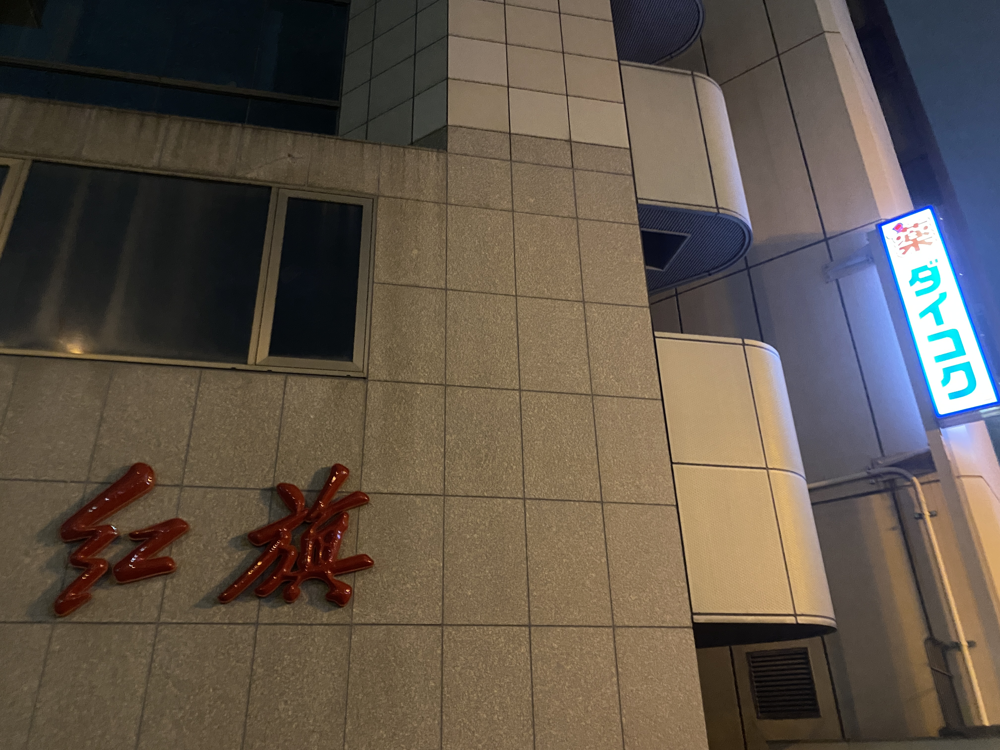
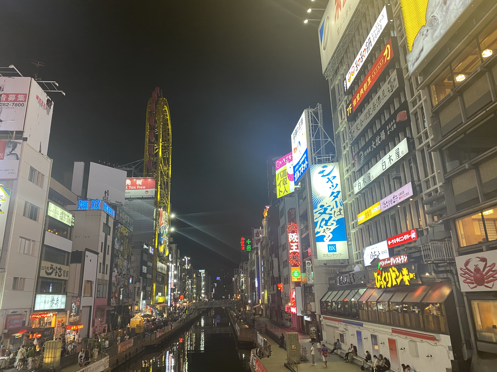
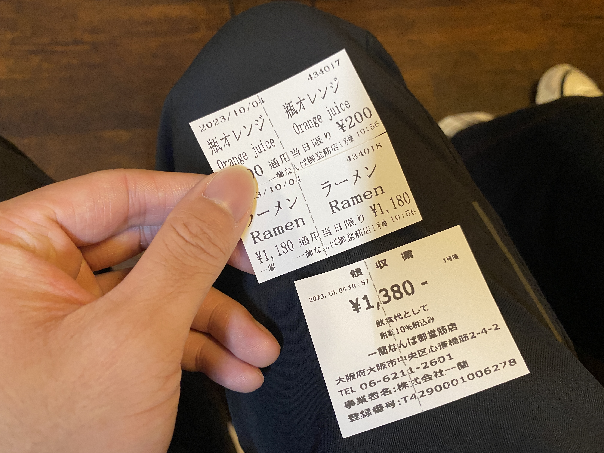

# Jp-Blog

 去日本的路程和心得体会

 准备工作：
 
 香港航空的话可以香港航空小程序提前办理值机

入境前要进入[VJW](https://www.vjw.digital.go.jp/)填写入境信息，要填两种信息获得蓝码和黄码，一个是入境信息，一个是行李信息吧好像

 公交卡：咸鱼买西瓜卡，买企鹅那种比welcome(樱花)的使用时间长，welcome好像是5年，苹果用户可以直接钱包添加西瓜卡

手机卡：淘宝买日本流量卡，或者国内运营商的卡开境外流量，应该花费都是55左右

# 10月3号 大阪
小程序琶洲港澳口岸可以买船票。广州琶洲坐船去香港机场，两个钟，在登船的地方就可以办好登机手续了，方便。

东京时间19:00PM, 关西大阪机场下机，坐列车到大阪难波站前往民宿, 八点多了

啥都好新奇，随便街拍

我敲，红旗

住在一个八坂神社旁边的民宿

民宿走廊朝上拍的

入住放好行李之后前往心斋桥附近逛。刚走出门下雨了，没带伞出来，去附近全家买了两把透明伞，第一次用日语跟人交流，全家小姐姐说话声音很可爱，不是大阪腔。半路拍一堆夜景。

大伙饿了，附近有家一兰拉面，不过刚好关门，尬住。

心斋桥附近瞎逛，然后随便找了家吃的，体验相当差。厨房师傅好像是个台湾人。炸鸡凉的，炒饭啥的也不好吃，啊，难受，人均100，吃完饭下大雨了，伞没白买，回去睡觉

# 10月4号 大阪、奈良

## 大阪早上

起床逛下楼下的神社

再去趟心斋桥

吃一兰拉面，可以全程不交流吃面。抹茶杏仁豆腐很好吃。

逛街

唐吉诃德买零食，终于喝到生可乐了。

回民宿拿行李前往奈良。

## 奈良

投喂梅花鹿只能用鹿仙贝，鹿仙贝200一捆，尝了一口，讲真还挺好吃的。

奈良的鹿进化出了很抽象的技能，投喂它会点头道谢。难道没学会点头的鹿都饿死了？

很多鹿，还遇到个小孩被鹿撅翻了。。。纪念品搞了个钱包

晚上六点多入住京都的民宿，六点半京都这居然灯黑完了，还以为十点多了。

收拾好行李出门吃饭，整个咖喱试一下，份量挺大，没啥特别的。

出来几个小伙伴想去伏见稻荷大社玩，我拉着另一个哥们去乐器店逛。乐器店讲日语开始有自信了，语言通了终于。

效果器好便宜，早知道再办个免税了，当时不会整。没搞免税的情况下买了个Boss BD-2和两套琴弦，BD-2比国内便宜200rmb，琴弦便宜25rmb，这不买？

摁着小伙伴把mygo看完了再睡觉，无敌。。

# 10月5号 京都

- 抓一个小伙伴跟我去轻音少女巡礼，轻音少女的舞台其实是把京都和丰乡小学拼起来的，丰乡小学太远了只能巡礼京都了，前往修学院站，出来左边就是一个巡礼点，然后继续往左走走到个桥，又是一个巡礼点

- 一路瞎逛，走到京都艺术大学，但是闲杂人等勿进。。转向京都大学

- 京都大学就随便进，太青春了，其实感觉和国内的大学差不多，来到的时候刚好饭点，大学里面有饭堂，也有开到学校里的快餐车，校园外有人用小推车推便当来卖，生意还不错。

- 京都大学旁边有个冷门神社，去的时候里面就两个人在歇息，第一次见到巫女，可惜没拍照，有三只巫女在运营这间神社，讲真这神社设计的很不错了，符合我对神社的印象，没啥人，风又凉爽，美哉。

- 坐车去四条河源町，一点多到达，出站就是个电子城，进去逛逛。逛到楼顶居然有卡店，买个Roselia的牌垫再说。日语点蛋糕咖啡，自信，加起来50块左右。

- 和伙伴们约好4点伏见稻荷大社，先在咖啡厅摆个烂。其实这会儿应该去二年坂三年坂的，可惜了

- 稻荷大社，山脚的和牛肉串很好吃，可惜有点凉，1000円一串，神户牛肉6000円一串，惊了，没敢点，听说入口即化。

- 逛逛逛。讲真一路上都是鸟居和一些小神社逛多了有点审美疲劳，山顶也挺普通的。山腰的小卖部可以买小鸟居写字让别人送上山放着。

- 回四条河源町想着吃放题来着，排队嗯是排不到，就去萨莉亚了，终于吃上正宗萨莉亚了。

- 晚上居酒屋。芜湖。

- 睡前看个番

# 10月6号 池袋

## 新干线

早上八点多起床，从京都的民宿出来，丹波口-京都-新干线-东京品川，再坐山手线到池袋，终于要到心心念念的池袋了！

本来预定11：30到池袋，然后在品川站迷路，要坐JY山手线从品川到池袋，但是品川站同一个Y轴上有两个地铁入口，迷路跑到下面那个，然后找2号站台，有个打扫的老爷爷跟我说这里没电车，然后我就问他池袋怎么走，就教我绕出去从另一个站入站。

好嘛，迷路10分钟终于坐上山手线，这天是周五，日本人的工作日，但是不知道为啥中午会有那么多人，体验了一波被别人挤进地铁的感觉。

坐了半个钟，池袋下车，已经12点了。。。池袋站四十几个出口，找地方出来都好麻烦，至今不会走，找地方放行李箱都找了半天。

搞定，去mygo巡礼，逛水族馆和看星星！

## mygo巡礼 地图打标

mygo巡礼主要是两条路线，rikki和灯皇上学/排练路线，主要通勤方式为都电荒川线；爱音和soyo上学/排练路线，主要交通方式为地铁。下面总结两条巡礼结束得出的不错的巡礼路线。

爱音上学路线以及池袋购物区巡礼标记点:

1. タカセ 池袋本店（池袋35号出口旁边的面包店）

2. ユニクロ 池袋サンシャイン６０通り店(Ring的原型，优衣库)

3. 豊島区立東池袋中央公園

4. 阳光水族馆

5. 水族馆旁边的展星台

灯皇上学路线标记点：

1. 东池袋四丁目

2. 学习院下站

3. 偷窥坂

4. 千登世橋

5. 成为人类桥(谷歌地图真的搜得到)

6. 鬼子母神前站

7. 飞鸟山公园(soyo快乐公园)

## mygo巡礼 正式巡礼

- 既然是从地铁站出来，那就先google导航到水族馆，爱音和soyo返程有一个我很喜欢的场景，11集的“soyorinもやめんなよ！”，记得是一个地铁口，然后地铁口有个面包店，我从25号出口出来，几乎是mygo巡礼的反方向。反正才中午，还有时间，绕着池袋顺时针转了半圈，终于找到了35号入口，实际上动画的弹幕里有人说是35号入口的，只是没认真看弹幕导致这么折腾，一个巡礼点完成，自己找到这个点，眼泪快流出来了

- 然后就简单了，从35号跟着导航往水族馆走，路上是一个很繁华的购物街，周五也很多人，中途路过了一家优衣库，这就是Ring的原型，Ring巡礼完成。

- 到达阳光城，这里其实爱音soyo线就已经差不多巡礼结束了，坐电梯到阳光城顶层，买票(2600円)进入阳光水族馆(女同水族馆)，是mygo相当重要的场景，灯皇和爱音交心的地方，对剧情的推进起了重要作用。进来本来是想直接去看企鹅的，但是不知道企鹅在哪，就先逛室内的部分，但是没想到室内的部分内容这么棒，一百五不到的门票太值了，逛完出来之后逛室外的，终于找到企鹅的位置。除了水里的企鹅，还有在室外换毛的企鹅，也相当的可爱，灯皇同步率++，逐渐理解灯皇的电波，巡礼完成

- 巡礼完在水族馆里的咖啡店吃个午饭，点了个热狗和咖啡，到了日本之后很喜欢喝东西不加糖。

- 为了值回票价再转一圈水族馆，第一次没怎么认真逛，走马观花，第二次认真静下心来逛，进入室内部分，水滴的声音拼凑成空灵的bgm。搭配深蓝色的灯光，心都静了下来。

- 水族馆里的动物的名字都有四国语言标识，中国人逛起来没啥压力，这天也还是国庆时间，所以国人的含量相当高，日本人的话大部分是跟着导游来的老爷爷老奶奶。

- 阳光水族馆本来就是一个有名的景点，很多大人带小孩过来逛，水族馆的装横相当的新和干净，后面才知道这是个开了十几年的水族馆，完全看不出来，如果住在日本的话我也会搞张年卡吧

- 在水族馆里的周边店买了件企鹅衣服和企鹅钱包，周边都相当的精美，可惜没找到治愈心灵的创可贴，但是第二天去的同伴找到了创可贴但是没找到钱包，可能里面的周边是每天都有限定的。

- 1点40分左右结束水族馆巡礼，满足了。赶紧出来买星象馆的票，星象馆是灯和初华剧情点，两个乐队的主唱在第二季在这应该还有剧情。有点尴尬的是，下一场星象馆的演出在2点50，买完票在这吹风吹了半天。

- 演出开始前20分钟进场，买票还挺麻烦的，挑时间，挑座位，问你有没有积分卡，不过看我是外国人，售票小姐姐直接推荐个好位置给我，就没让我整些挑座位的语法了。

- 星象馆是用一个两百多平的半球形屏幕来播放一段微电影，看的这场相当不错，神谷浩史旁白，讲了四个迷茫的年轻人和星星的故事，每次讲完一段都会插入一段bgm，Aimer的《ポラリス》响起的时候刚好是剧情有点小高潮的时候，眼泪差点没绷住，这一段讲的是一个一开始追着音乐梦想的女生，29岁的时候放弃梦想在船上工作的故事，这个女生在甲板上遇到一个男同事，然后问这个男生为什么来干这份工作，男生说他喜欢看星星，两个人就在船上聊北极星的更替的故事。这段剧情感觉是mygo第10集灯皇和初华聊星星的原型。旁白用北极星更替去类比梦想更替或者深造，都是没有固定答案的个人选择，希望大家不管怎样都能向前走。到了最后没想到居然有反转，四个小故事的角色居然都是有联系的，比如这个甲板上的男生其实是另一个故事的主角。门票1600円，个人感觉值回票价，歌很好听，感觉心灵被治愈了，灯皇同步率++，星象馆的故事的主题感觉都很符合mygo“即使迷茫也要前进”的主旨，脚本老师肯定是调研过的。

- 星象馆出来，跑到阳光城一楼，往西门走，出来右转就能看到mygo经常出现的阶梯，看过攻略说周末这里人会很多，所以我才挑周五过来，果然没什么人，狠狠地巡礼，阶梯有个楼梯能走到附近的东池袋中央公园，是第4集爱音被骂破防逃跑的地方，巡礼点+1

- 四点多了，回池袋站找行李，找完行李去订的青旅check in，check in的时候有点尬，用了gmail的ID Darkness注册的agoda账号，然后入住的时候管理员找不到我护照的名字，相当的抽象，一开始用英文跟我说了半天我都没听懂多少，reservation我还要去查下是啥意思，后来发现我听得懂日语就直接日语了，相当曲折。

- 顺利放好行李，和师兄汇合，在一家中餐馆吃饭，点餐直接用中文了，没蚌住，吃完去逛逛Animate总部，很多漫画，当天还有死亡笔记的活动，大排长龙。Animate买东西需要在当层结账。其实去日本多买点漫画轻小说没关系的，自用的东西过海关没啥难度。

- 晚上了，再巡礼一次阳光城阶梯的场景，晚上的灯光很美。然后师兄去涩谷玩了，我继续巡礼

- 到我最喜欢的环节，前往东池袋四丁目坐都电荒川线，rikki和伟大的灯皇的通勤线，人不多，很惬意的一条线路，两边都是好看的绿植。rikki下车回家的站应该是面影桥站或者早稻田站，tomorin下车的站是鬼子母神站，其实距离不远，rikki送tomorin回家后走回家应该也就十来分钟，时间有限，我决定砍掉rikki部分的面影桥巡礼点（对不起rikki），前往学习院下站，这个站出来90米就能到达有名的巡礼点偷窥坂，soyo追祥子，和路人女主圣人惠飞帽的场景都是在这里，这个坡坡度很大，穿着裙子的女生在坡顶容易走光，所以叫偷窥坂？

- 走上偷窥坂后左转，到达灯和祥子初见的千登世桥，很漂亮的一个地方，就算没有动画，日本很多列车轨道附近都能找个不错的构图，可能因为轨道的拓扑结构本来就很好看？动画里的情节是早上，所以准备白天再来巡礼一次。

- 过了千登世桥，再走一段到达有名地点，成为人类桥——千登世步道桥，mygo相当多的剧情都是在这展开的，眼泪绷不住了

- 回青旅，整理下行李，洗澡，准备第二天下北泽的孤独摇滚巡礼。

# 10月7号 池袋、新宿、下北泽、浅草

## mygo巡礼 part2

- 起床！再去一次千登世桥和偷窥坂，早餐吃了两个饭团一瓶boss咖啡，巴适！

- 九点多，想起来还有个地方可以巡礼，飞鸟山公园，惊世一跪，在学习院下站坐都电荒川线前往，早上坐这辆车很惬意，没什么人，轻微摇晃的车厢，凉爽的晨风，干净的轨道和充满活力的植物，人精神多了，也让思维变得清晰，灯皇同步率++，开始逐渐理解这位电波少女

- 飞鸟山公园，巡礼大失败，这天很多初高中在这摆摊办活动，没怎么巡礼，忘记巡礼祥子的“家”了。

- 还有时间，回阳光城再看一次星星，这次看的没那么有意思，直接睡着了，尬住。

- 巡礼完池袋感觉再看一次mygo心境又不同了，在这个地方上学玩乐队的学生家里就没有一个穷的，祥子，我的祥子😭

## 下北泽

- 吃个饭前往下北泽，周末人很多，储物柜爆满，直接拖着行李箱巡礼。很多吃饭的地方有和波奇的联动，应该是吃饭集章，然后去车站前兑换东西，周围超多波奇元素，到处都是波奇酱，路人妹子个个都知道孤独摇滚，火了一年了。一部动画带火了本来只是卖中古物出名的下北泽，太强啦，mygo什么时候能火遍池袋。

- 本多剧场-shettle-拍照墙-公园

- 巡礼完才四点多，在公园等一手师兄，然后一起去吃个饭，吃饭时隔壁桌日本年轻人很热情，用英语问我们是不是要英语菜单，实际上这桌三个懂日语的hhhh，天妇罗没了，点点别的。

- 吃完饭六点多，去Shettle看看能不能看live，居然可以买现场票，4100日元一张，收银小姐姐和卖饮料的小姐姐都很可爱。收银小姐姐看我们是中国人还问小伙伴是不是看了漫画过来巡礼的。

- 看live，第一支和第三支乐队的重金属风格不是很喜欢，但是他们玩的很嗨，第二支弹流行乐的乐队不错。吉他小哥弹的funk和布鲁斯我很喜欢，前两个乐队用的都是把Gibson的SG，全程都有人跳水2333，第二只乐队的吉他手直接躺在人群里弹。

- 下北泽这玩音乐的真多，很多老哥背着吉他提着效果器箱子，用Gibson的挺多都的，真富啊，有朝一日也想搞一把。

## 浅草

浅草是住宿的地方，附近走十几分钟可以到天空树，坐银座线很快可以到秋叶原，很舒服的位置，睡觉前去天空树附近拍照，附近的江景很像珠江。路上遇到警察追暴走族，过瘾。

# 10月8号 涩谷、秋叶原
